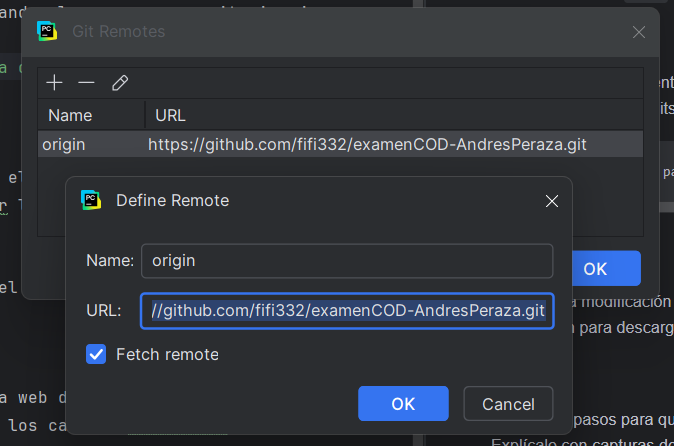
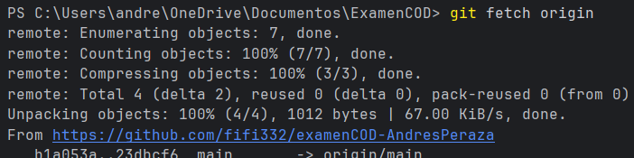
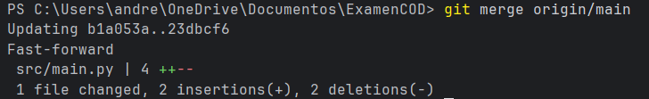
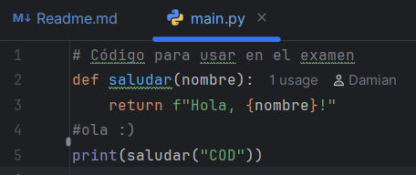
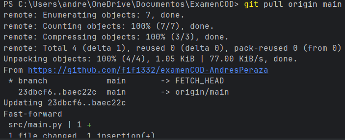
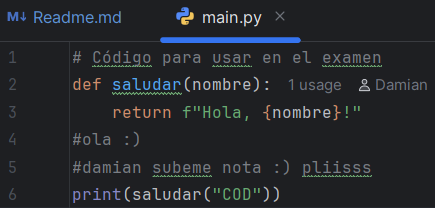

# Examen 1ª Evaluación (2ª Parte) - Control de Versiones
Andres Peraza Nascimento
---

## Instrucciones
- Los commits de cada apartado deben tener el mensaje *"Apartado X - descripción del cambio realizado"*
- Entrega en la tarea de Moodle tu repositorio
- Solo se corrigen los commits que estén en el repositorio remoto

### Apartado 1

- Clona este repositorio.
- Modifica este Readme, poniendo tu nombre completo, realiza un `commit` con el mensaje *"Apartado 1"* y un `push`.

Pregunta 
- ¿Qué paso es fundamental cuando clonamos un repositorio ajeno para que podamos subir nuestros propios commits? Explícalo y utiliza capturas de pantalla.

        cambiar el remoto para que apunte a un repositorio donde si tengas permisos de escritura.

### Apartado 2

- Realiza una modificación en el código en la web de tu repositorio en GitHub
- Utiliza fetch para descargar los cambios realizados en tu repositorio.

Pregunta
- Explica los pasos para que el código modificado en GitHub, llegue a tu rama principal local. Explícalo con capturas de pantalla.

paso1:

    git fetch origin
Esto actualiza origin/main con lo último que hay en GitHub, pero tu rama main local no cambia todavía.

paso 2:

    git merge origin/main
incorpora los cambios remotos.

### Apartado 3

- Realiza otro cambio desde la web de tu repositorio en GitHub.
- Utiliza pull para descargar los cambios realizados en tu repositorio.

Pregunta
- Explica los pasos dados para que el cambio realizado en GitHub, llegue a tu rama principal local. Explícalo con capturas de pantalla.

paso 1: Descargar y fusionar los cambios con git pull:

    git pull origin main

Esto hace dos cosas:
- Descarga los cambios desde GitHub.
- Los integra directamente en tu rama local.

